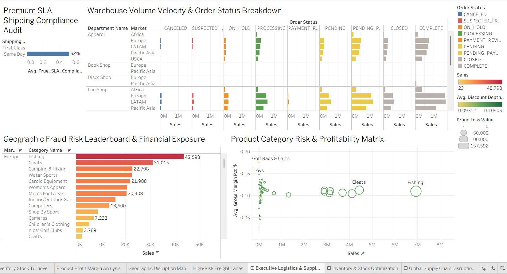
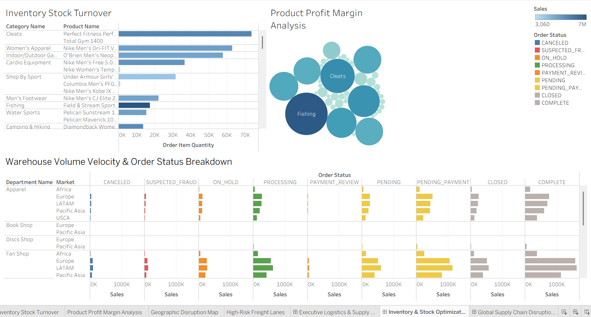
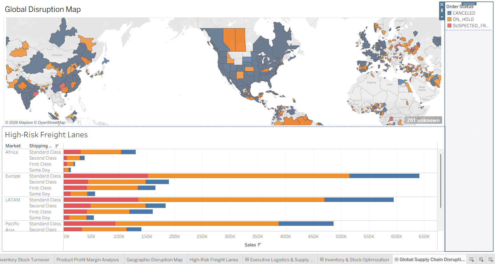

# DataCo Supply Chain Optimization & Risk Management Suite

An enterprise-grade analytics application built in Tableau Desktop evaluating logistics network inefficiencies, inventory velocity bottlenecks, and international fraud financial exposure using the DataCo Global Supply Chain dataset. 

👉 **[Click Here to View the Live Interactive Dashboard on Tableau Public](https://public.tableau.com/app/profile/aishwarya.srivastava2387/viz/DataCo_Supply_Chain_Executive_Suite/GlobalSupplyChainDisruptionRiskMap#1)**

---

## 📊 Executive Dashboard Suite Summaries

### 1. Logistics, Fulfillment & Financial Exposure

* **The Carrier SLA Crisis:** Same-Day Shipping compliance sits at a critical **52%**, meaning nearly half of premium expedited shipments experience delivery variances.
* **Product Vulnerabilities & Fraud Leakage:** Within the European sector, **Fishing** ($43,598) and **Cleats** ($31,015) are actively targeted for fraudulent activity.
* **The Matrix Paradox:** While Fishing and Cleats serve as primary volume anchors (approaching $5M–$7M in gross revenue), their security profile makes them high financial leakage risks. High-margin categories like Golf Bags (~18%) fail to achieve the sales scale required to balance these losses.
* **Strategic Action:** Enforce contractual SLA non-compliance penalties on same-day carriers and deploy targeted fraud verification barriers during checkout for top-tier apparel and sport segments.

---

### 📦 2. Inventory & Stock Optimization

* **Volume Drivers:** Physical warehouse velocity is led by **Cleats** with over 75K units moved. **Fishing and Cleats** maintain the highest overall profit margin profiles, anchoring stable fulfillment.
* **Warehouse Bottlenecks:** While traditional apparel categories flow smoothly to completion, **Fan Shop inventory** is experiencing severe processing backlogs, heavily gridlocked in `PENDING` and `PENDING_PAYMENT` flags within Europe and LATAM.
* **Strategic Action:** Prioritize high-velocity warehouse shelf footprint for Cleats and Fishing components while auditing the localized checkout/payment gateway integrations handling Fan Shop portfolios to clear capital backlogs.

---

### 🌐 3. Global Supply Chain Disruption & Risk Map

* **Primary Bottleneck:** **Europe** acts as the core supply chain bottleneck, stranding over **$600K in vulnerable sales** in stagnant transit states. LATAM and Pacific Asia shadow this behavior with nearly $500K each in exposed capital.
* **The "Standard Class" Trap:** Across every global boundary evaluated, **Standard Class shipping** houses the overwhelming majority of `ON_HOLD` and `SUSPECTED_FRAUD` exceptions. Premium modes remain highly secure.
* **Strategic Action:** Mandate automated, strict risk pre-screening on all incoming orders selecting Standard Class fulfillment bound for Europe or LATAM to clear processing friction.

---

## ⚙️ Technical Blueprint
* **Data Architecture:** Columnar Data Extract (`.hyper`) snapshotting global operational logistics logs.
* **Interactivity:** Integrated Global Action Filters across sheets allowing complete drill-down manipulation from high-level maps down to granular shipping lanes.
* **Tooling:** Tableau Public Desktop, Markdown Documentation.
